## About Me

Hi, I'm Keval 👋

> I'm a pre final year student who loves building things that create an impact. I work with modern web and cloud technologies, learn new tools constantly, and enjoy collaborating on projects.

- 🔭 I’m currently working on building highly scalable 
- 🌱 I’m currently learning: Generative AI and DevOps to broaden my full-stack and deployment skills
- 👯 I’m open to collaborate on open source projects
- 💬 Ping me with anything related, I will try to help unless I am low on ram! 
- ⚡ Fact: Currently on a self development journey

### Connect with Me

---

### Tech Stack

Below are the primary technologies and tools I work with — feel free to reorder or remove any.

